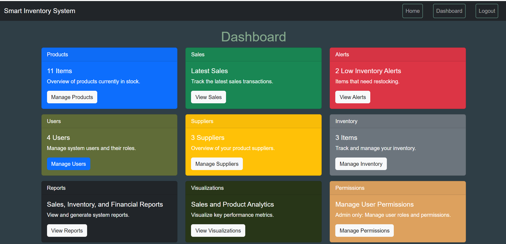

# 📦 Smart Inventory System




"Smart Inventory System Dashboard"

---

## 📖 Table of Contents
- [About the Project](#about-the-project)
- [Features](#features)
- [Getting Started](#getting-started)
  - [Prerequisites](#prerequisites)
  - [Installation](#installation)
  - [Running the Application](#running-the-application)
- [Usage](#usage)
- [API Documentation](#api-documentation)
- [Deployment](#deployment)
- [Built With](#built-with)
- [Contributing](#contributing)
- [License](#license)
- [Contact](#contact)

---

## 🏗️ Architecture
For a detailed explanation of the system’s architecture, refer to the 
[Architecture Documentation](./architecture.md).

## 📝 About the Project
The **Smart Inventory System** simplifies inventory management by enabling 
users to monitor stock levels, track sales, and automate reorder alerts. 
With a focus on streamlined functionality, the system currently supports 
essential features across five primary tables: **products**, **sales**, **users**, **suppliers**, 
and **inventory**. Designed for scalability, this solution will soon expand to include 
additional data tables, which you can preview on the dashboard, making it adaptable 
to growing business needs. Built with Python, Flask, and PostgreSQL, the Smart 
Inventory System offers a reliable foundation for effective inventory control 
and future feature enhancements.

---

## ✨ Features
- **Real-Time Inventory Tracking:** Know exactly what’s in stock at any moment.
- **Automated Reorder Alerts:** Get notified when stock falls below a specified threshold.
- **User Role Management with JWT Authentication:** Ensure secure access and permissions.
- **Sales Integration:** Easily track and analyze product sales data.
- **API Documentation with Swagger:** Quickly explore and test endpoints.
- **User-Friendly Interface:** Responsive design for seamless navigation on any device.

---

## 🚀 Getting Started

### Prerequisites
Before you begin, ensure you have the following installed:
- Python 3.8+
- PostgreSQL
- Node.js and npm (for frontend setup)
- Flask and other dependencies (listed in `requirements.txt`)

### Installation
1. **Clone the Repository:**
   ```bash
   git clone https://github.com/yourusername/smart-inventory-system.git
   cd smart-inventory-system

2. **Create and Activate a Virtual Environment:**
   ```bash
   python3 -m venv venv
   source venv/bin/activate  # On Windows, use `venv\Scripts\activate`

3. **Install Python Dependencies:**
   ```bash
   pip install -r requirements.txt`
   
4. **Set Up PostgreSQL Database:**
    Create a PostgreSQL database for the project.
    Configure the database settings in the .env file.

5. **Install Python Dependencies:**
   ```bash
   flask db upgrade

6. **Install Python Dependencies:**
   ```bash
   flask run
   
**Running the Application:**

  Once the application is running, navigate to http://127.0.0.1:5000 
  in your browser to access the Smart Inventory System.

## 📊 Usage
- **Dashboard:** Get a quick overview of inventory and sales information.
- **Inventory Management:** Add, edit, and delete products, and track stock levels.
- **Sales Tracking:** Access sales records and monitor product performance.
- **Low Inventory Alerts:** Receive notifications when stock falls below the reorder threshold.
- **User Management:** Admins can add, edit, and assign roles to users.

## 📖 API Documentation
The Smart Inventory System includes built-in API documentation using Swagger. This allows you to explore the API and view detailed information about available endpoints.

### To access the Swagger UI:
1. **Start the Flask server.**
2. **Open your browser and go to:** `http://127.0.0.1:5000/api/docs`

### Authentication
- The API uses **JWT** for secure user authentication. When a user logs in, a JWT token is provided, which must be included in the headers of authenticated requests:

   ```http
   Authorization: Bearer <your-token-here>

## 🛠️ Built With
This project was built using the following technologies:
-  
-  
-  
-  
-  
- 

---

## 📜 License
Distributed under the MIT License. See LICENSE for more information.

## 📬 Contact
Maria Fe Fischer - afefischer@gmail.com

Project Link:[ https://github.com/yourusername/smart-inventory-system](https://smart-inventory-management-1.onrender.com)


